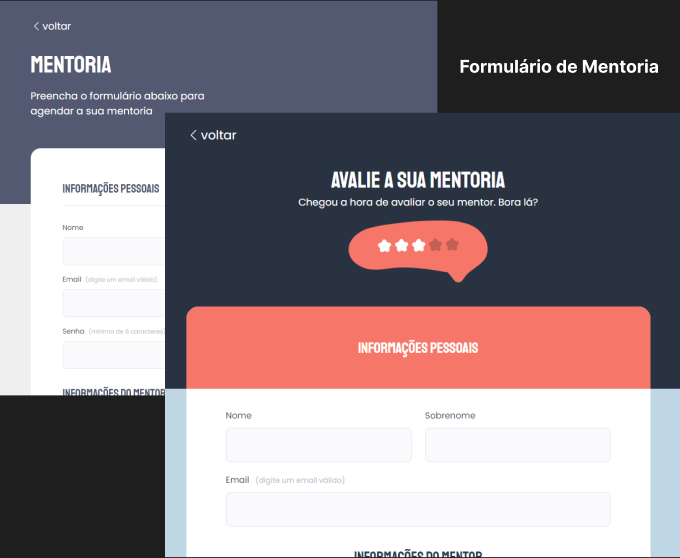

<h1 align="center"> Formulário de Mentoria </h1>

Projeto desenvolvido no stage 3 do programa Explorer da Rocketseat, que simula dois formulários, um para agendar uma mentoria e outro para avaliar a mentoria. São dois projetos mas eu decidi juntar os dois projetos em um, criando um menu simples para navegar entre eles.  

  <a href="#-tecnologias">Tecnologias</a>&nbsp;&nbsp;&nbsp;|&nbsp;&nbsp;&nbsp;
  <a href="#-projeto">Projeto</a>&nbsp;&nbsp;&nbsp;|&nbsp;&nbsp;&nbsp;
  <a href="#-layout">Layout</a>&nbsp;&nbsp;&nbsp;|&nbsp;&nbsp;&nbsp;
  <a href="#memo-licença">Licença</a>

  

 

  

## 🚀 Tecnologias

Esse projeto foi desenvolvido com as seguintes tecnologias:

- HTML
- CSS
- Git e Github
- Figma

## 💻 Projeto

Esse projeto simula dois formulários, um para agendar uma mentoria e outro para avaliar uma mentoria, esses formulários possui diversos campos para serem preenchidos e submetidos.

- [Acesse o projeto finalizado, online](https://jhgomess.github.io/formulario-mentoria/)

## 🔖 Layout

Você pode visualizar o layout do projeto através [DESSE LINK](<https://www.figma.com/file/f3H3xWuMLyYLI2J9LNWkcx/Stage-03---Formul%C3%A1rio-avan%C3%A7ado-(Copy)?type=design&node-id=0-1&mode=design&t=JY7JXMGjuR2pHI40-0>). É necessário ter conta no [Figma](https://figma.com) para acessá-lo.

## :memo: Licença

Esse projeto está sob a licença MIT.

---

Feito com ♥ by Rocketseat :wave: [Participe da nossa comunidade!](https://discord.gg/rocketseat)
